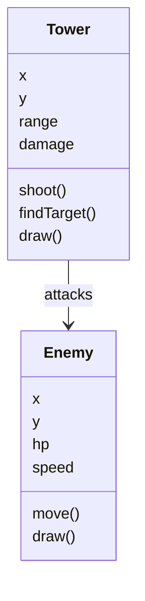

```mermaid
classDiagram

class Tower {
    x
    y
    range
    damage
    shoot()
    findTarget()
    draw()
}

class Enemy {
    x
    y
    hp
    speed
    move()
    draw()
}

Tower --> Enemy : attacks
```