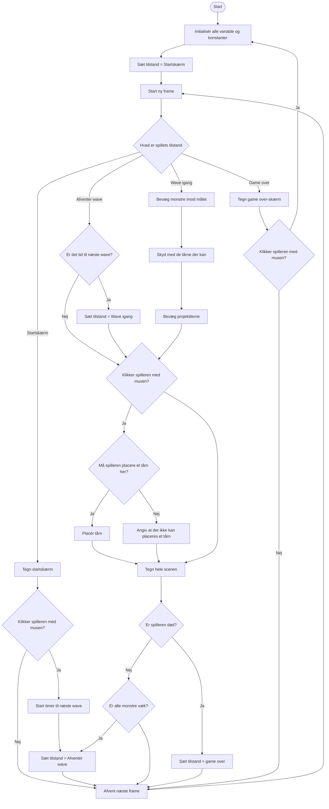

## Features:
- Towers
    - Forskellige typer
        - Lave-penge tårn
        - Lav range + høj dps tårn (og omvendt)
        - Ice tower
        - Firetower
        - Lyn tårn (chaining)
        - Luft tårn (push)
        - Poison tower
    - Special abilities
        - Cooldown
    - Opgraderinger
    - Merge/Kombinationer
    - Permanente opgrades/unlocks

- Shop menu

- Waves

- Monstre
   - Forskellige typer
        - Regenerate
        - Skjold
        - High speed/low speed
   - Boss
   - Monstre giver penge/xp når de rammes
   
- Sound effects
- Brugeren
    - Health 
    - Penge
- Map med en vej
    - Pile der indikerer hvor fjenderne kommer fra
- Sprites
- Start menu
    - Score board
    - Sværhedsgrad
    - Flere levels
- Instillingsmenu

## MVP

### Must have:
- 1 type tårn
    - Skal kunne skyde
    - Skal koste penge
- 1 type monster
    - HP
    - Gøre skade når de kommer igennem banen
- Map med en bane
- Brugeren
    - Health
    - Penge
- Forskellige waves
    - Bliver sværere

### MVP game loop

C --> D[/Spilleren placerer tårne/]
    D --> E[Tårne angriber monstre]
    E --> F{Monster besejret?}
    F -->|Ja| G[Spilleren får coins]
    F -->|Nej| E
    G --> H{Alle monstre besejret?}
    H -->|Nej| C
    H -->|Ja| nywave
    C --> J{Monster når målet?}
    J -->|Ja| K[Spilleren mister HP]
    K --> L{Spillerens HP = 0?}
    L -->|Ja| M[Game over skærm]
    L -->|Nej| C
    M -->startspil

### MVP funktionelle krav

#### Tårn
- Spillet skal indeholde én type tårn.
- Spilleren skal kunne placere et tårn på banen med musen.
- Det skal koste penge at placere et tårn.
- Spilleren skal ikke kunne placere et tårn, hvis spilleren ikke har penge nok.
- Spilleren skal ikke kunne placere et tårn på banen.
- Et tårn skal automatisk kunne skyde på monstre inden for dets rækkevidde.

#### Monster
- Spillet skal indeholde én type monster.
- Et monster skal have et antal HP, som kan reduceres, når monsteret tager skade.
- Et monster skal forsvinde fra spillet, når dets HP er mindre end eller lig 0.
- Et monster skal kunne bevæge sig gennem banen mod spillerens mål.
- Spilleren skal miste health, når et monster kommer igennem banen.

#### Map
- Spillet skal indeholde et map med en bane, som monstrene skal følge fra start til mål.
- Spilleren skal kunne placere tårne på bestemte områder af banen.
- Spillerens penge skal reduceres, når spilleren køber et tårn.
- Spilleren skal modtage penge, når et monster bliver besejret.

#### Spiller
- Spilleren skal have en health-værdi.
- Spilleren skal have en mængde penge.
- Spillerens penge skal reduceres, når spilleren køber et tårn.

#### Waves
- Spillet skal indeholde flere waves.
- Hver wave skal indeholde en eller flere monstre.
- Sværhedsgraden skal stige mellem waves.
- En wave skal afsluttes, når alle dens monstre er besejret eller har nået målet.